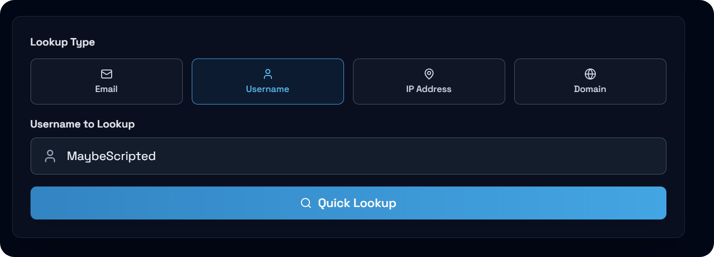
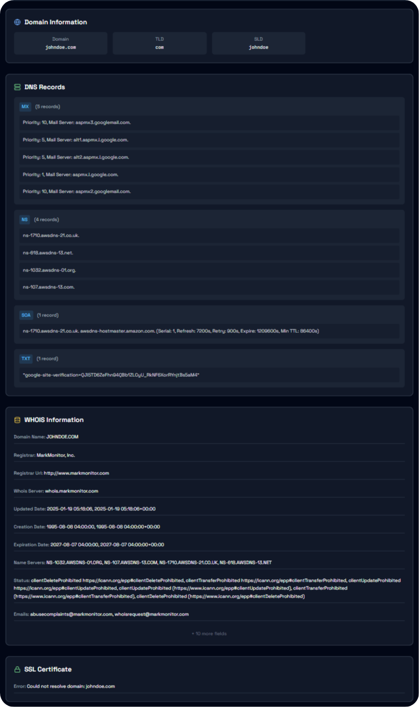
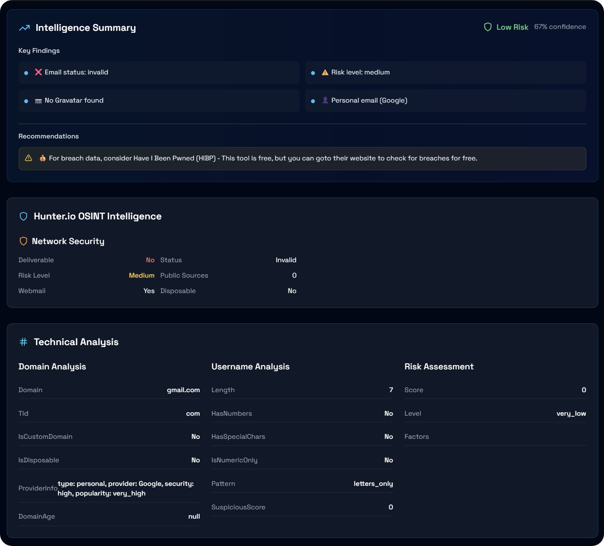
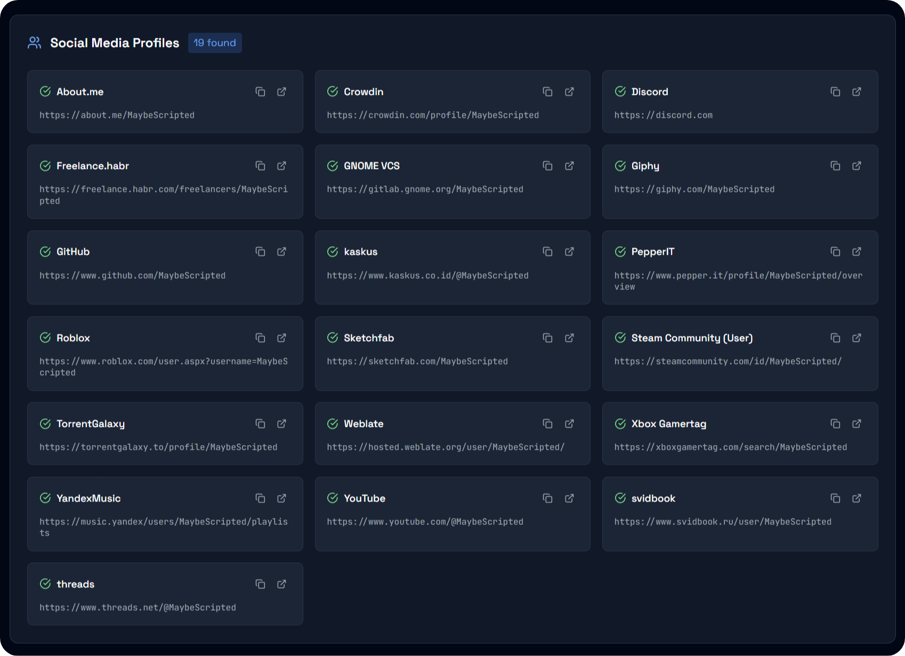
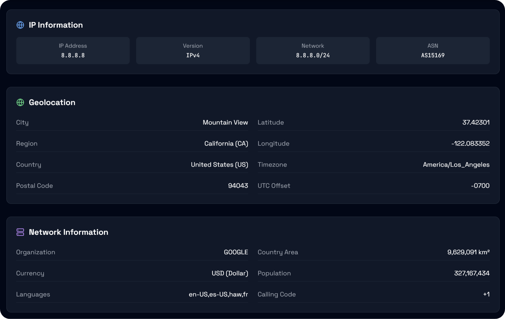

# 🛠️ OSINT Toolkit

a Website/Project that allows you to use multiple free APIs and tools into one place.



## Setup

```bash
# 1. Clone and install
git clone <your-repo>
cd osint-toolkit  
npm run install:all

# 2. Setup Sherlock (username lookups)
git clone https://github.com/sherlock-project/sherlock.git
cd sherlock && pip install -r requirements.txt

# 3. Add API keys (optional)
cd ../backend && cp env.example .env
# Edit .env with HUNTER_API_KEY=your_key and RAPIDAPI_KEY=your_key

# 4. Start everything
npm run dev
```

Open http://localhost:3000

## Features

### 🔍 Domain Lookup
Get comprehensive domain information including DNS records, WHOIS data, and SSL certificates.



### 📧 Email Analysis
Verify email addresses and easily get person/company information.



### 👤 Name Lookup
Search for people across various platforms and find out where they have an account.



### 🌐 IP Intelligence
Get a solid IP and geolocation data.



## APIs Used

- **Hunter.io**        - Email verification, person/company enrichment
- **RapidAPI WHOIS**   - Domain DNS records, WHOIS data, and SSL certificates
- **Gravatar**         - Profile images and social profiles
- **ipapi.co**         - IP geolocation (free, 1000/day)
- **VirusTotal**       - IP reputation (free, 500/day)  
- **Sherlock**         - Username social media discovery (local)

## Development

```bash
npm run dev              # starts frontend + backend, run in root
cd sherlock && python sherlock_api.py  # starts username service. incase you wanna only test that
```

**Frontend**: http://localhost:3000  
**Backend**: http://localhost:3001  
**Sherlock**: http://localhost:3002

---


